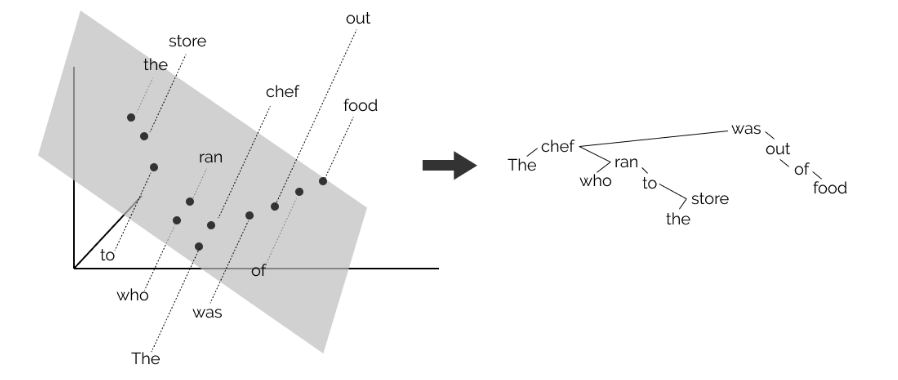
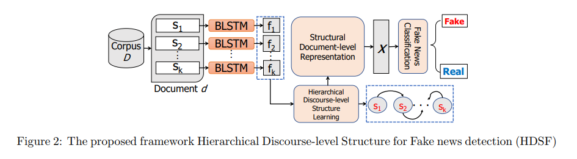
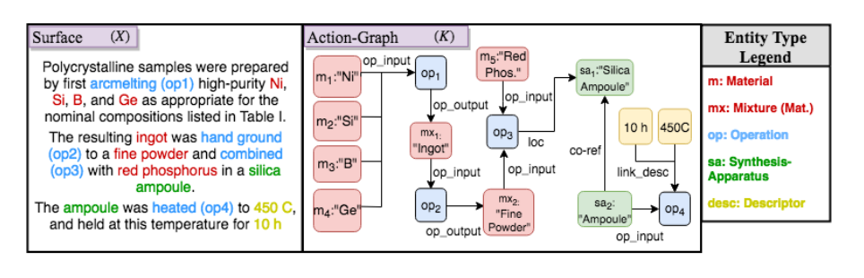

# Notes on NAACL 2019

This is a summary from a selection of papers presented at NAACL 2019, including the NeuralGen workshop.

Full list of papers (main conference and workshops): https://aclweb.org/anthology/events/naacl-2019/

---

**Some general comments:**

- There was a lot of interesting work I was not able to see, particularly:
    - question answering, reading comprehension and commonsense reasoning (this is booming; here is a recent survey: Storks et al., Commonsense Reasoning for Natural Language Understanding: A Survey, 2019).
    - knowledge graphs, knowledge-base completion
    - clinical/bio-medical applications. There was interesting work presented at the **clinical NLP workshop**, as well as a **clinical NLP tutorial.**
- I saw a lot of great work on:
    - low-resource settings (cross-lingual; few-shot learning; zero-shot learning)
    - information extraction
    - text generation
- It was good to see papers that were not concerned with chasing SOTA:
    - some nice error analysis papers (e.g., Hayes, "What just happened?")
    - papers introducing new datasets (Kim et al., "AudioCaps"; Geva et al., "DiscoFuse"; McHardy et al., "Adversarial Training for Satire Detection", Bamman et al.,"An annotated dataset of literary entities") and benchmarks (e.g., WiC: the Word-in-Context Dataset)
    - evaluation (which is particuarly difficult for language generation tasks)
- It seemed like BERT was everywhere (ELMo too, but mostly BERT), and large language models are here to stay.
    - The good:
        - Interesting work on probing these models (eg. Hewitt and Manning, "A Structural Probe for Finding Syntax in Word Representations")
        - Some good work exploring how best to use them on downstream tasks.
    - The bad:
        - The sentiment "BERT is will solve all your problems" is more common than it should be, and not helpful. There were many great papers that did not use (and perhaps did not need) BERT!

See also Sebastian Ruder's highlights: http://ruder.io/naacl2019/index.html

---

- [Topics](#topics)
  - :school_satchel: [Using external knowledge](#using-external-knowledge-school_satchel) 
  - :bowling: [Learning with Limited Data](#learning-with-limited-data-bowling)
      - [Few-shot learning](#few-shot-learning)
      - [Zero-shot learning](#zero-shot-learning)
      - [Huge label set](#huge-label-set)
      - [Domain adaptation](#domain-adaptation)
      - [Weak supervision, distantly-labeled data](#weak-supervision-distantly-labeled-data)
  - :speech_balloon: [Language Models](#language-models-speech_balloon)
  - :abcd: [Word representations](#word-representations-abcd)
    - [Combining or aligning embeddings](#combining-or-aligning-embeddings)
  - :busts_in_silhouette: [Discourse](#discourse-busts_in_silhouette)
  - :eyes: [Attention](#attention-eyes)
- [Tasks](#tasks)
  - :memo: [Text Generation](#text-generation-memo)
  - :mag: [Authorship Attribution, Stylometry, Fake News](#authorship-attribution-stylometry-fake-news-mag)
  - :gem: [Summarization](#summarization-and-simplification-gem)
  - :ok::accept: [Machine Translation](#machine-translation-okaccept)
  - :paperclips: [Text Classification](#text-classification-paperclips)
  - :cityscape::boy: [Named Entity Recognition](#named-entity-recognition-cityscapeboy)
  - :repeat: [Relation extraction](#relation-extraction-repeat)
  - :key::bookmark_tabs: [Keyphrase extraction](#keyphrase-extraction-keybookmark_tabs)
  - :spider_web: [Knowledge Graph Completion](#knowledge-graph-completion-spider_web)
  - :book::question: [Reading Comprehension and Question Answering](#reading-comprehension-and-question-answering-bookquestion)
- [Applications](#applications)
  - :hospital: [Clinical and biomedical applications](#clinical-and-biomedical-applications-hospital)
  - :shield::computer: [Cybersecurity applications](#cybersecurity-applications-shieldcomputer)
- :octopus: [Other applications and tasks](#other-applications-and-tasks-octopus)
- [Other](#other)
- [Keynote Lectures](#keynote-lectures)
- [NeuralGen Workshop](#neuralgen-workshop)
- [Coreference and Coherence Revisited](#coreference-and-coherence-revisited)

# Topics

## Using external knowledge :school_satchel:

##### (Poster) Incorporating Context and External Knowledge for Pronoun Coreference Resolution

Pronoun coreference cases such as: "The dog is chasing the cat, but it climbs the tree." What kind of knowledge is used?

- linguistic features (animacy, plurality, gender) obtained from Stanford CoreNLP.
- selectional preferences (frequency of predicate-argument tuples). For example: a cat is more likely to climb than a dog.

A neural network with attention mechanisms for both context and knowledge is used to get SOTA results for this task.

---

##### (Poster) OpenKI: Integrating Open Information Extraction and Knowledge Bases with Relation Inference

---

##### (Poster) Connecting Language and Knowledge with Heterogeneous Representations for Neural Relation Extraction

---

##### :boom: [Integrating Semantic Knowledge to Tackle Zero-shot Text Classification](#boom-integrating-semantic-knowledge-to-tackle-zero-shot-text-classification)

---

## Learning with Limited Data :bowling:

##### :repeat: Structured Minimally Supervised Learning for Neural Relation Extraction. Fan Bai and Alan Ritter.

---

### Few-shot learning

##### :boom::boom: Text Classification with Few Examples using Controlled Generalization

#####  :spider_web: Long-tail Relation Extraction via Knowledge Graph Embeddings and Graph Convolution Networks

##### :boom:(Poster) Learning Relational Representations by Analogy using Hierarchical Siamese Networks

--- 

### Zero-shot learning

##### :boom: (Poster) Description-Based Zero-shot Fine-Grained Entity Typing

---

##### :boom: Integrating Semantic Knowledge to Tackle Zero-shot Text Classification

To better classify text with labels unseen at training time, the proposed framework incorporates "semantic knowledge" of four different kinds:

- word embeddings
- class descriptions
- class hierarchy
- a knowledge graph

---

##### The Strength of the Weakest Supervision: Topic Classification Using Class Labels

**Motivation**: labeling initial examples for every new task is expensive. Using the class labels themselves could help give a "warm start".

Related ideas:
- in IR: treat short label as query and evaluate similarity between document and label ("Naive Text Classification" in Baeza-Yates et al. IR book).
- extreme form of semi-supervised learning (see refs).

**Method**:
1. a simple generative model "word embedding naive Bayes" (WENB) is used to obtain soft pseudo-labels for the documents using only pre-trained word embeddings and the words from the class labels.
2. The pseudo-labels are combined with true labels for continued training using logistic regression.

The proposed method is more effective than competing (semi-supervised and retrieval-based) approaches in short-document settings (Wiki Titles, News Titles, Yahoo questions), and performs worse on 20 Newsgroups, Reuters-21578 and a medical WSD dataset.

---

##### (Could not attend) Zero-Shot Cross-Lingual Opinion Target Extraction

---

### Huge label set

#####  (Could not attend) A Submodular Feature-Aware Framework for Label Subset Selection in Extreme Classification Problems. Elham J. Barezi, Ian D. Wood, Pascale Fung and Hamid R. Rabiee

##### (Poster) :boom::boom: Imposing Label-Relational Inductive Bias for Extremely Fine-Grained Entity Typing

---

### Domain adaptation

#####  :boom: (Poster) **Simplified Neural Unsupervised Domain Adaptation. Timothy Miller**
  - Code: https://github.com/tmills/Neural-SCL-Domain-Adaptation

---

#####  (Poster) Curriculum Learning for Domain Adaptation in Neural Machine Translation. Xuan Zhang, Pamela Shapiro, Gaurav Kumar, Paul McNamee, Marine Carpuat and Kevin Duh

---

#####  (Poster) Non-Parametric Adaptation for Neural Machine Translation. Ankur Bapna and Orhan Firat

---

#####  :paperclips: (Could not attend) Adversarial Category Alignment Network for Cross-domain Sentiment Classification. Xiaoye Qu, Zhikang Zou, Yu Cheng, Yang Yang and Pan Zhou

---

#####  (Could not attend) Joint Learning of Pre-Trained and Random Units for Domain Adaptation in Part-of-Speech Tagging.

---

##### :boom: Using Similarity Measures to Select Pretraining Data for NER

---

### Weak supervision, distantly-labeled data

##### :boom: Learning to Denoise Distantly-Labeled Data for Entity Typing

---

##### Exploiting Noisy Data in Distant Supervision Relation Classification

-----

##### Improving Distantly-supervised Entity Typing with Compact Latent Space Clustering

---

##### :repeat: GAN Driven Semi-distant Supervision for Relation Extraction

---

##### (Could not attend) Handling Noisy Labels for Robustly Learning from Self-Training Data for Low-Resource Sequence Labeling

---

## Language Models :speech_balloon:

##### :boom: A Structural Probe for Finding Syntax in Word Representations

**Questions**: What linguistic information is contained in BERT and ELMo vectors? Can we extract dependency parse trees from them?  Answer: yes! Note the subtle difference between learning something and being extractable by a probe (or "diagnostic classifier"; see the Saphra and Lopez paper for more on this).

**Background**: Why is this even possible? Language modeling is a hard task: so to do language modeling well, one implicitly (hopefully) learns higher-level linguistic information.

**How to extract trees from sequences of vectors**:

Find a linear transformation such that vector distances encode trees. Will the minimum spanning tree recover an actual dependency tree? This worked surprisingly well! The following illustration is from https://nlp.stanford.edu/~johnhew/structural-probe.html:

**Other recent "probing" papers to look at (#Bertology)**:

- Saphra and Lopez, Understanding Learning Dynamics Of Language Models with SVCCA, NAACL 2019
- Tenney, Das and Pavlick, Bert rediscovers the classical NLP pipeline
- What Does BERT Look At? An Analysis of BERT's Attention
- Open Sesame: Getting Inside BERT's Linguistic Knowledge
- Visualizing and Measuring the Geometry of BERT

**Some older interesting probing papers**:
- Colorless Green Recurrent Networks Dream Hierarchically, 2018
- LSTMs Can Learn Syntax-Sensitive Dependencies Well, But Modeling Structure Makes Them Better, 2018
- Dissecting Contextual Word Embeddings: Architecture and Representation, 2018
- Assessing the Ability of LSTMs to Learn Syntax-Sensitive Dependencies, 2017

**Blog**: https://nlp.stanford.edu/~johnhew/structural-probe.html

**NAACL Slides**: https://nlp.stanford.edu/~johnhew/public/hewitt2019structural_slides.pdf

**NLP Highlights Podcast**: https://soundcloud.com/nlp-highlights/88-a-structural-probe-for-finding-syntax-in-word-representations-with-john-hewitt

**Code**: https://github.com/john-hewitt/structural-probes

---

##### Linguistic Knowledge and Transferability of Contextual Representations

ELMo and BERT word very well across many tasks. But WHY? What linguistic knowledge do they capture?

Use a linear probing model to investigate BERT, ELMo (+variants), OpenAI Transformer on 17 different tasks.

Which layer is most transferable?
- LSTMs: first layer!
- Transformers: all layers are similar

BiLM pretraining yields representations that are more transferable in general (even on PTB-sized data), but not as good at tasks requiring specific linguistic knowledge

---

##### :boom: (Could not attend) Show Some Love to Your n-grams: A Bit of Progress and Stronger n-gram Language Modeling Baselines

---

##### Knowledge-Augmented Language Model and Its Application to Unsupervised Named-Entity Recognition

---

##### (Could not attend) An Embarrassingly Simple Approach for Transfer Learning from Pretrained Language Models

##### (Could not attend) Serial Recall Effects in Neural Language Modeling. Hassan Hajipoor, Hadi Amiri, Maseud Rahgozar and Farhad Oroumchian

##### (Poster) WiC: the Word-in-Context Dataset for Evaluating Context-Sensitive Meaning Representations. Mohammad Taher Pilehvar and Jose Camacho-Collados

##### (Could not attend) **Show Some Love to Your n-grams: A Bit of Progress and Stronger n-gram Language Modeling Baselines. Ehsan Shareghi, Daniela Gerz, Ivan Vulić and Anna Korhonen**

---

## Word representations :abcd:

##### :boom: Word-Node2Vec: Improving Word Embedding with Document-Level Non-Local Word Co-occurrences

Despite progress in better word representations (word embeddings), the most popular methods are split between purely local and global approaches:

- Local approaches: co-ocurrence of words in a window of fixed size (e.g., word2vec, GloVe)
- Non-local approaches: LSA, LDA

Can we combine the best of both? Words that co-occurr frequently but non-locally within documents may have semantic association that local models are not capturing.

**Idea:** use convex combination of local and non-local co-ocurrence weights in a graph-based framework (each word is a node, and co-ocurrence information is expressed in edge weights).

- word2vec (skip-gram): context of a word is words in a fixed window. Try to predict the context words for each target word.
- node2vec (Grover and Leskovec, 2016): context to be predicted is a sequence of nodes visited by a random walk starting from a target node.
- word2vec, graph formulation (unweighted version): rather than do a random walk, let context be the subgraph that is within distance 2 of a given node (two hops).
- word2vec, graph formulation (weighted version): can adapt this to use weighted edges. The weights are computed using both global information (co-ocurrence probabilities of words in a document) and local information (co-ocurrence probabilities of word pairs within a window, similar to GloVe). Then sample neighbours proportional to the weights of the edges. (The sampling strategy is different than node2vec.)

**Evaluation:** concept categorization (AP, BLESS, ESSLI), word similarity prediction and word analogy. Word-node2vec outperforms Glove, FastText, and word2vec (but looking at their table, it is often not a very large improvement).

**Code:** https://github.com/procheta/Word-Node2Vec

---

##### What just happened? Evaluating retrofitted distributional word vectors

This was a nice error analysis paper (refreshing to see!) It investigates discrepancies in the retrofitting method of Faruqui et al (2015) over different lexical resources (WordNet, FrameNet, PPDB). They find:

- RMSE is better at capturing gains in performance than correlation measures
- Improvements are highly dependent on the lexical resource's coverage of the evaluation benchmark.

So caution: word vector performance must be inspected very carefully!

---

##### :boom: (Poster) :eyes: **Attentive Mimicking: Better Word Embeddings by Attending to Informative Contexts**

##### (Poster) A Systematic Study of Leveraging Subword Information for Learning Word Representations.

##### (Poster) SC-LSTM: Learning Task-Specific Representations in Multi-Task Learning for Sequence Labeling. Peng Lu, Ting Bai and Philippe Langlais

##### Augmenting word2vec with latent Dirichlet allocation within a clinical application. Akshay Budhkar and Frank Rudzicz
  - See in "biomedical"

##### (Poster) Better Word Embeddings by Disentangling Contextual n-Gram Information

Training word embeddings jointly with bigram and trigram embeddings supposedly help remove contextual information from the unigrams => better word embeddings.

---

#### Combining or aligning embeddings

##### :boom: Density Matching for Bilingual Word Embedding

Presented by Graham Neubig.

**Scenario**:
- reconcile existing independently-trained embeddings in different languages
- unsupervised learning

Instead of learning a transformation between sets of embedding vectors,
define a probability distribution over embeddings (Gaussian mixture model)
and match the two densities using *normalizing flow** (see Rezendre and Mohamed, 2015).

A normalizing flow is a sequence of invertible transformations between distributions.

**Code**: (PyTorch implementation) https://github.com/violet-zct/DeMa-BWE

---

##### :boom: Cross-Lingual Alignment of Contextual Word Embeddings, with Applications to Zero-shot Dependency Parsing

This paper deserves a closer read.

**Question**: how to align independently-trained contextual embeddings? (this paper used ELMo) Particularly interested in the low-resource target language setting.

Challenges:

- multipe senses per token
- many vector representations per sense

This cross-lingual transfer is used for zero-shot and few-shot dependency parsing, with state-of-the-art results on several languages.

**Code**: https://github.com/TalSchuster/CrossLingualELMo ; will be part of AllenNLP soon.

---

##### :boom: Cross-Topic Distributional Semantic Representations Via Unsupervised Mappings

**Problem:** traditional Distributional Semantic Models (DSMs) cannot capture polysemous words (each word is mapped to a vector).

**Proposed solution**: assume words appear with a single sense within a topic. Train topic-based DSMs, then project all to a single space:
- Use LDA to obtain topic distributions for each sentence in a corpus. Create topic-specific corpora by mapping sentences to a corresponding topic if the topic probability > threshold. Then train word2vec for each sub-corpus.
- Use monosemous "anchors" to help find the alignment. The list of anchors are found using an unsupervised method.

The method performs well on a contextual semantic similarity evaluation, and on downstream tasks (paraphrase identification, text classification).

Related work on finding transformations between independently-trained embeddings:

- Machine translation: Mikolov, Yih and Zweig, NAACL 2013; Xing et al., NAACL 2015; Artetxe et al., EMNLP 2016
- Historical word embeddings: Hamilton, Leskovec and Jurafsky, ACL 2016.
- Lexical resources enrichment: Prokhorov et al., 2017. Learning rare word representations using semantic bridging. 

**Code:** https://github.com/Elbria/utdsm_naacl2018

---

##### :boom:  (Poster) **Aligning Vector-spaces with Noisy Supervised Lexicon. Noa Yehezkel Lubin, Jacob Goldberger and Yoav Goldberg**

---

## Discourse :busts_in_silhouette:

##### DiscoFuse: A Large-Scale Dataset for Discourse-Based Sentence Fusion

---

##### :boom: Linguistically-Informed Specificity and Semantic Plausibility for Dialogue Generation

---

##### Mining Discourse Markers for Unsupervised Sentence Representation Learning

---

##### :boom: (Poster) Evaluating Coherence in Dialogue Systems using Entailment

---

##### (Poster) Modeling Document-level Causal Structures for Event Causal Relation Identification. Lei Gao, Prafulla Kumar Choubey and Ruihong Huang

---

## Attention :eyes:

##### (Poster) Simple Attention-Based Representation Learning for Ranking Short Social Media Posts. Peng Shi, Jinfeng Rao and Jimmy Lin

##### (Poster) **Attentive Convolution: Equipping CNNs with RNN-style Attention Mechanisms. Wenpeng Yin and Hinrich Schütze**

##### (Could not attend) **Attention is not Explanation**

##### (Could not attend) **Convolutional Self-Attention Networks. Baosong Yang et al.**

##### (Could not attend) Saliency Learning: Teaching the Model Where to Pay Attention. Reza Ghaeini, Xiaoli Fern, Hamed Shahbazi and Prasad Tadepalli

##### (Poster) Attentive Mimicking: Better Word Embeddings by Attending to Informative Contexts

---

# Tasks

## Text Generation :memo:

##### :boom: (Demo) compare-mt: A Tool for Holistic Comparison of Language Generation Systems

##### :boom: (Demo) fairseq: A Fast, Extensible Toolkit for Sequence Modeling

##### (Poster) Fixed That for You: Generating Contrastive Claims with Semantic Edits. Christopher Hidey and Kathy McKeown

##### (Poster) Generating Text through Adversarial Training Using Skip-Thought Vectors

---

##### (Could not attend) AudioCaps: Generating Captions for Audios in The Wild.

Examples of generated sound captions: https://audiocaps.github.io/

---

##### (Could not attend) An Empirical Investigation of Global and Local Normalization for Recurrent Neural Sequence Models Using a Continuous Relaxation to Beam Search.

##### (Could not attend) **Accelerated Reinforcement Learning for Sentence Generation by Vocabulary Prediction**. Kazuma Hashimoto and Yoshimasa Tsuruoka

##### :boom: (Could not attend) Structural Neural Encoders for AMR-to-text Generation. Marco Damonte and Shay B. Cohen

##### Improved Lexically Constrained Decoding for Translation and Monolingual Rewriting

---

##### :boom: Answer-based Adversarial Training for Generating Clarification Questions

Clarification Questions are context aware questions that ask for missing
Information. For example:

- How to configure path or set environment variables for installation?

**Goal:** generate more useful questions.

Can use context, question and answer triples: try to generate clarification
question "from scratch" (previous work just ranked a list of clarification
questions).

** Baseline**: sequence-to-sequence (maximize likelihood of context, question pairs). Given the context, it generates a question.

**Problem:** This tends to generate a lot of generic questions. Eg:

- is this made in China?

Also a common problem in dialogue generation.

**Solution:** Use RL. Input the question to an an answer generator. Then
use a utility calculator (given question, context and answer) as reward
to retrain the question generator.

But how to train the utility calculator?

- Option 1: pretrain it. "Max-utility"
- Option 2: (a bit better) use GAN ("Gan-utility"). Answer generator + utility calculator as discriminator. Question generator is generator.

Evaluations on these datasets:

- StackExchange (Rao and Daume III 2018)
- Amazon home and kitchen (McAuley and Yang 2018)

Evaluation type:

- Human rating on various scores:
  - How grammatical is it?
  - How useful is it?
  - How relevant is it?
  - Specific to the context?

Example outputs:

- Original: are these pillows firm and keep their shape
- Max-Likelihood: what is the size of the pillow?
- GAN-Utility: does this pillow come with a cover or ...

**Code available:** https://github.com/raosudha89/clarification_question_generation_pytorch

---

##### Improving Grammatical Error Correction via Pre-Training a Copy-Augmented Architecture with Unlabeled Data

Contributions:

- copy-augmented architecture for GEC task
- pre-train with augmented data

Different than ML: since most of the words can be copied. Copy unchanged
and OOV from the source sentence. Incorporate "copy mechanism" into seq2seq
with attention.

**Problem:** not enough training data. **Solution:** pre-training.

Inspired by BERT, ful pre-training with augmented data (randomly deleting
adding, replacing, shuffling). Also tried two auxiliary tasks for multitask
learning.

Experiments:

- Most of improvements come from the copy mechanism.

- Very nice error type classification. Error breakdown by types: determiner, wrong collocation, spelling, punctuation, preposition, noun number, redundancy, verb tense, etc..

Audience Questions:

- Q: Why didn't you use BERT? BERT is everything now!
- A: future work.

**Code:**  https://github.com/zhawe01/fairseq-gec

---

##### Topic-Guided Variational Auto-Encoder for Text Generation

TL;DR: Can generate text conditioned on a given topic, and adapted to summarization.

Many applications of text generation:

- machine translation (MT)
- dialogue generation
- text generation

VAE are widely used for this. But problems:

- isotropic Gaussian prior cannot indicate the semantic structure.
- "posterior collapse" issue.

Main contribution: new topic-guided VAE (TGVAE) for text generation.

---

##### :boom: Text Generation with Exemplar-based Adaptive Decoding

**Problem**: encoder-decoder (seq2seq) architecture has been very successful (particularly with attention and copy mechanisms), but generated text is uncontrolled, unreliable, and often generic. On the other hand, hand-crafted templates are less scalable.

**Solution**: A new conditioned text generation model, inspired by old-school template-based text generation, where there is a division of labor:

- source provides content: "what to say"
- template provides content: "how to say it"

Instead of using templates, use "exemplar" text from the training data as a "soft template" for the decoder. This method performs well on summarization and data-to-text tasks.

**Example:**

- **Source**:  Norway said Friday it would give Zimbabwe 40 million kroner (7.02 million dollars, 4.86 million euros) in aid to help the country deal with a lack of food and clean drinking water and a cholera outbreak.
- **Template**: ___ grants aid of __ to __
- **Exemplar:** Norway boosts earquake aid to Pakistan.
- **Target**: Norway grants aid of 4.86 million euros to Zimbabwe.

**Slides:** https://homes.cs.washington.edu/~hapeng/slides/peng2019text.pdf

**Code**: https://github.com/google-research/language/tree/master/language/labs/exemplar_decoding

---

##### :boom::boom: Reinforcement Learning Based Text Style Transfer without Parallel Training Corpus

---

##### :boom: Learning to Describe Unknown Phrases with Local and Global Contexts

---

##### (Could not attend) Jointly Optimizing Diversity and Relevance in Neural Response Generation

-----

##### Pragmatically Informative Text Generation

Why does generation need pragmatics? Generation as a pragmatic game. Some principles (Grice):
- convey all the relevant information
- be informative in context

**Code**: https://github.com/sIncerass/prag_generation

---

##### :boom: Unifying Human and Statistical Evaluation for Natural Language Generation

---

##### Stochastic Wasserstein Autoencoder for Probabilistic Sentence Generation

---

##### (Could not attend) Pre-trained language model representations for language generation

---

##### :boom: Text Generation from Knowledge Graphs with Graph Transformers

---

##### Improving Human Text Comprehension through Semi-Markov CRF-based Neural Section Title Generation

##### Towards Content Transfer through Grounded Text Generation

---

##### Pun Generation with Surprise

---

##### :boom: (Poster) Evaluating Text GANs as Language Models

TL;DR: language models currently perform a lot better than text GANS.

---

##### :boom: (Poster) Step-by-Step: Separating Planning from Realization in Neural Data-to-Text Generation

---

##### :boom: (Poster) Text Generation from Knowledge Graphs with Graph Transformers

---

## Authorship Attribution, Stylometry, Fake News :mag:

##### :boom: Generalizing Unmasking for Short Texts

**TL;DR:** Boosting is applied to the "unmasking" method for authorship verification, making the method feasible for "short" texts. It is particularly useful when the goal is high precision. 

Two related tasks:
- **Authorship attribution:** determine the authorship of one text from a limited number of authors.
- **Authorship verification:** given two texts, determine if they are written by the same author.

Authorship verification is often more realistic (when there are millions of possible authors) and in some sense more fundamental than authorship attribution.

This paper generalizes the **unmasking** approach (Koppel and Schler, ICML 2004) to "short" texts (here "short" means about 4 printed pages, rather than book-length text), with a method emphasizing precision.

**Intuition:** texts by the same author differ only in a few superficial features. So the CV accuracy will drop faster when the texts are by the same author than when they are by different authors. 

**Unmasking algorithm:**

- From each text, create non-overlapping chunks of at least 500 words each

- Use BOW features (but with only 250 most frequent words)

- Obtain a curve (features removed against CV accuracy) by iterating the following:
    - Do 10-fold CV between the two texts with a linear SVM.
    - Eliminate the most discriminating features for the model

- Train a classifier on the curves to determine authorship.

**Problem:** doesn't work for short texts because there is not enough material for chunks, and too much noise (see experiments in Sanderson and Guenter, 2006).

**Proposed solution**: Since unmasking uses BOW features anyway, we can use bagging. Create chunks by sampling without replacement to create each chunk.  Then run the unmasking algorithm and average.

**Benefits**: 

- Can achieve very high precision with low recall; (other methods result in balanced precision and recall).  False positives can lead to a wrong conviction!
- Easier to tune hyperparameters than other approaches.
- Must faster than RNN-based approach (Bagnall, 2015).

**Code and data:** https://github.com/webis-de/NAACL-19

---

##### :boom: Adversarial Training for Satire Detection: Controlling for Confounding Variables. Robert McHardy, Heike Adel and Roman Klinger

**Motivation:** Models for satire detection might be learning the characteristics of the publication source. This is (a) for generalization, (b) misleading (we don't want Onion detectors, we want satire detectors).

**Goal:** use adversarial training to improve the robustness of the model against confounding variable of publication source.

**Model:** Figure 1 from the paper:

The "adversary" (publication identifier) is trying to get the model to perform badly at detecting the publication name. This idea was used in Ganin et al. JMLR (2016) for domain adaptation (a classifier for class labels and a domain discriminator adversary) using "gradient reversal": the sign of the gradient of the satire discriminator is flipped when backpropagating.

**Results:**
- This was tested on real and satirical German news. Publication identification performance was reduced with little effect on satire detection performance.
- Inspection of attention weights:
    - Example 1: the baseline model (no adversary) focuses on "dpo" (a parody of German newsire "dpa"; this is unique to this publication source).  The model with adversarial training ignores this word. In another example
    - Example 2: the baseline model spreads attention evenly across all words. The adversarial model finds more specific cues for satire.

**Code and data:** www.ims.uni-stuttgart.de/data/germansatire ; https://bitbucket.org/rklinger/adversarialsatire/src/master/

---

##### :boom: Learning Hierarchical Discourse-level Structure for Fake News Detection

**Problem:** Many detectors of fake news ignore hierarchical discourse-level structure. Some challenges:
- Many discourse methods rely on corpora such as Penn Discourse Treebank. There is no available annotated discourse corpus for news.
- How to use hierarchical discourse-level structure to detect fake news is an open challenge.

**Method**: This approach, Hierarchical Discourse-level Structure for Fake news detection (HDSF) is shown above (Figure 2 from the paper). Briefly:
- First learns dependency trees of sentences from the data: two sentences are linked when one "semantically depends" on the other.
    - Use BiLSTM to encode each sentence of the document to obtain a sequence of sentence representations.
    - These are used to learn an inter-sentential attention matrix; this contains the probabilities that sentence m is the parent of sentence s.
    - Probability of each sentence being the root node is also calculated from the data.
    - Construct a dependency tree from these probabilities with a greedy algorithm:
        - The highest probability sentence is the root node.
        - Greedily add child nodes (each node should have only one parent)
- Use the dependency tree to obtain a document-level representation.
    - For each discourse unit (sentence) obtain a structurally-aware representation (various weighted averages of the sentence vectors).
    - Average all the resulting vectors to obtain a document-level representation.
- Use fully connected layer to classify the fake news. Train end-to-end.

**Note:** it appears that the computed discourse trees are actually not used for classification; but rather they are used to obtain properties (including parent-child distances, number of root leaves) for explainability. There is a substatial difference in the document-level structure of fake and real news (real news is more coherent).

**Note**: For an example of vectorizing RST trees, see Rubin and Lukoianova, Truth and Deception at the Rhetorical Structure Level, 2015.

**Evaluation**: on five fake news datasets combined, with 3360 fake and 3360 real documents.  HDSF is compared to:
- n-grams+SVM
- LIWC (Linguistic Inquiry and Word Count)+SVM
- RST+SVM (Ji and Eisenstein RST parser, but vectorized how?)
- BiGRNN-CNN; two different LSTMs

HDSF outperforms all others (82% accuracy) followed by the LSTM[w+s] (80%); RST is the worst (67%); LIWC and n-grams are pretty bad too (70%, 72%), since they don't account for document structure.

Q: But why is RST so bad? A: Using an RST that does do well with out-of-domain (news) text.

**Code:** https://github.com/hamidkarimi/HDSF

---

##### (Poster) Fake News Detection using Deep Markov Random Fields

##### Graph convolutional networks for exploring authorship hypotheses

(Cultural Heritage, Social Science, Humanities and Literature Workshop)

---

## Summarization :gem:

##### Data-efficient Neural Text Compression with Interactive Learning

**Text compression:** condensing one or more sentences into a shorter text of a given length containing the most important information.  Used for summarization.

This paper presents a seq2seq method (with attention) with active learning to learn an in-domain model quickly, and then adapt it to a new domain/genre.

**Code:** https://github.com/UKPLab/NAACL2019-interactiveCompression

---

##### :boom: Guiding Extractive Summarization with Question-Answering Rewards

**TL;DR:** RL with a novel reward function (judging summary's adequacy, fluency, length, and ability to answer questions); using question answering as part of the reward signal helps with summarization.

**Problem**: despite recent progress in neural abstractive summarization, they sometimes alter information, falsify or add details. Extractive summarization ("highlighting") does not have such drawbacks, but it is expensive to get enough labeled data.

**Idea**: good extractive summaries should have enough information in them to answer questions. Use this signal in 

**Code**: https://github.com/ucfnlp/summ_qa_rewards

---

##### (Could not attend) SEQˆ3: Differentiable Sequence-to-Sequence-to-Sequence Autoencoder for Unsupervised Abstractive Sentence Compression.

##### (Could not attend) Abstractive Summarization of Reddit Posts with Multi-level Memory Networks. Byeongchang Kim, Hyunwoo Kim and Gunhee Kim

##### (Could not attend) Complexity-Weighted Loss and Diverse Reranking for Sentence Simplification. Reno Kriz et al.

##### (Could not attend) :boom: Fast Concept Mention Grouping for Concept Map-based Multi-Document Summarization
---

## Machine Translation :ok::accept:

##### :boom:  (Poster) Lost in Machine Translation: A Method to Reduce Meaning Loss. Reuben Cohn-Gordon and Noah Goodman
##### (Poster) Understanding and Improving Hidden Representations for Neural Machine Translation.

---

## Text Classification :paperclips:

##### :boom::boom: [Text Classification with Few Examples using Controlled Generalization](#boomboom-text-classification-with-few-examples-using-controlled-generalization)

---

##### Adaptive Convolution for Text Classification

Instead of using a fixed set of filters, use adaptive convolution (convolutional filters that are conditioned on the inputs).

---

##### :boom: (Poster) **Vector of Locally-Aggregated Word Embeddings (VLAWE): A Novel Document-level Representation**

---

##### (Poster) An Effective Label Noise Model for DNN Text Classification

##### (Poster) **Detecting depression in social media using fine-grained emotions**

##### (Could not attend) Mitigating Uncertainty in Document Classification. Xuchao Zhang, Fanglan Chen, ChangTien Lu and Naren Ramakrishnan

##### (Could not attend) How Large a Vocabulary Does Text Classification Need? A Variational Approach to Vocabulary Selection.

##### (Could not attend) Rethinking Complex Neural Network Architectures for Document Classification. Ashutosh Adhikari, Achyudh Ram, Raphael Tang and Jimmy Lin

---

##### (Could not attend) Self-Discriminative Learning for Unsupervised Document Embedding

This is supposed to work well in the scarce label setting

---

## Named Entity Recognition :cityscape::boy:

##### Pooled Contextualized Embeddings for Named Entity Recognition. Alan Akbik, Tanja Bergmann and Roland Vollgraf

---

##### (Poster) Practical, Efficient, and Customizable Active Learning for Named Entity Recognition in the Digital Humanities. Alexander Erdman et al.

##### Better Modeling of Incomplete Annotations for Named Entity Recognition

##### [Using Similarity Measures to Select Pretraining Data for NER](#boom-using-similarity-measures-to-select-pretraining-data-for-ner)

##### [Knowledge-Augmented Language Model and Its Application to Unsupervised Named-Entity Recognition](#knowledge-augmented-language-model-and-its-application-to-unsupervised-named-entity-recognition)

---

## Relation extraction :repeat:

##### [GAN Driven Semi-distant Supervision for Relation Extraction](#repeat-gan-driven-semi-distant-supervision-for-relation-extraction)

##### (Could not attend) Structured Minimally Supervised Learning for Neural Relation Extraction. Fan Bai and Alan Ritter

##### (Could not attend) **Document-Level N-ary Relation Extraction with Multiscale Representation Learning**. Robin Jia, Cliff Wong and Hoifung Poon

##### (Poster) Relation Classification Using Segment-Level Attention-based CNN and Dependency-based RNN

##### (Poster) Distant Supervision Relation Extraction with Intra-Bag and Inter-Bag Attentions

##### (Poster) A Richer-but-Smarter Shortest Dependency Path with Attentive Augmentation for Relation Extraction

---

## Keyphrase Extraction :key::bookmark_tabs:

##### :boom: (Poster) Glocal: Incorporating Global Information in Local Convolution for Keyphrase Extraction

##### (Could not attend) Keyphrase Generation: A Text Summarization Struggle. Erion Çano and Ondřej Bojar

##### (Poster) An Integrated Approach for Keyphrase Generation via Exploring the Power of Retrieval and Extraction.

##### (RepEval workshop) Multi-Context Term Embeddings: the Use Case of Corpus-based Term Set Expansion

---

## Knowledge Graph Completion :spider_web:

##### Graph Pattern Entity Ranking Model for Knowledge Graph Completion. Takuma Ebisu and Ryutaro Ichise

##### [Long-tail Relation Extraction via Knowledge Graph Embeddings and Graph Convolution Networks](#spider_web-long-tail-relation-extraction-via-knowledge-graph-embeddings-and-graph-convolution-networks)

##### (Poster) Generating Knowledge Graph Paths from Textual Definitions using Sequence-to-Sequence Models

##### :boom: (Poster) Fact Discovery from Knowledge Base via Facet Decomposition

##### :boom: (Poster) Relation Discovery with Out-of-Relation Knowledge Base as Supervision

---

## Reading Comprehension and Question Answering :book::question:

##### :boom: BAG: Bi-directional Attention Entity Graph Convolutional Network for Multi-hop Reasoning Question Answering

Achieves SOTA performance using Graph ConvNets on the QAngaroo WIKIHOP dataset (Welbl et al. 2018): http://qangaroo.cs.ucl.ac.uk/

Here is an example of the task from the QAngaroo paper:

**Question:** (Hanging gardens of Mumbai, country, ?)
**Options:** {Iran, India, Pakistan, Somalia...}

**Document 1:** The Hanging Gardens, in **[Mumbai]**, also known as Pherozeshah Mehta Gardens, are terraced gardens..They provide sunset views over the **[Arabian Sea]** ...

**Document 2:** **[Mumbai]** (also known as Bombay, the official name until 1995) is the capital city of the Indian state of Maharashtra. It is the most populous city in **[India]**...

**Code:** https://github.com/caoyu1991/BAG

---

##### (Poster) DROP: A Reading Comprehension Benchmark Requiring Discrete Reasoning Over Paragraphs. Dheeru Dua, Yizhong Wang, Pradeep Dasigi, Gabriel Stanovsky, Sameer Singh and Matt Gardner

---

##### (A best paper) CommonsenseQA: A Question Answering Challenge Targeting Commonsense Knowledge. 

Challenging new dataset for question answering: CommonsenseQA. Crowd-workers are encouraged to create questions that require prior knowledge:

- based on knowledge encoded in ConceptNet (Speer et al., 2017)
- crowd workers generate questinos that describe the relation between concepts from ConceptNet, eg:
    - given river and waterfall, "Where on a river can you hold a cup upright to catch water on a sunny day?"
    - possible answers: {waterfall, bridge, valley, pebble, mountain}

Fine-tuning BERT-large on the commonsenseQA obtains highest performance (55% accuracy), but still much lower than human performance (88.9%).

This is really impressive but somewhat mysterious - **language models can store large amounts of information related to commonsense knowledge**. How is it doing this? I think there will soon be more work on probing BERT for commonsense knowledge.

**Data**: www.tau-nlp.org/commonsenseqa
**Code:** github.com/jonathanherzig/commonsenseqa

---

##### (Could not attend) Improving Machine Reading Comprehension with General Reading Strategies. Kai Sun, Dian Yu, Dong Yu and Claire Cardie

##### (Could not attend) **Repurposing Entailment for Multi-Hop Question Answering Tasks. Harsh Trivedi et al.**

##### (Could not attend) Understanding Dataset Design Choices for Multi-hop Reasoning. Jifan Chen and Greg Durrett

##### :boom: Alignment over Heterogeneous Embeddings for Question Answering

---

# Applications

## Clinical and Biomedical Applications :hospital:

##### (Poster) A Bag-of-concepts Model Improves Relation Extraction in a Narrow Knowledge Domain with Limited Data

A corpus of 200 breast cancer follow-up treatment notes with distinct relation types to extract.

##### (Poster) Biomedical Event Extraction based on Knowledge-driven-LSTM

##### (Could not attend) Multilingual prediction of Alzheimer’s disease through domain adaptation and concept-based language modelling.

##### (Could not attend) :boom: Augmenting word2vec with latent Dirichlet allocation within a clinical application. Akshay Budhkar and Frank Rudzicz

##### (Could not attend) Inferring Which Medical Treatments Work from Reports of Clinical Trials

##### Multilingual prediction of Alzheimer’s disease through domain adaptation and concept-based language modelling

---

## Cybersecurity applications :shield::computer:

##### (Poster) Detecting Cybersecurity Events from Noisy Short Text

##### (Poster) Analyzing the Perceived Severity of Cybersecurity Threats Reported on Social Media

##### (Poster) Predicting Malware Attributes from Cybersecurity Texts

---

# Other applications and tasks:octopus:

##### (Poster) AttentiveChecker: A Bi-Directional Attention Flow Mechanism for Fact Verification

State-of-the-art results on the FEVER fact-checking dataset. For each factual claim, the system must extract textual evidence from Wikipedia to support or refute the claim. A neural network model does this by:
- retrieving relevant documents (reducing the search space)
- sentence selection: choose top-k sentences from each document
- claim verification: given the claim and extracted supporting sentences, output label {supported, refuted, notEnoughInfo}.

---

##### (Poster) Text Similarity Estimation Based on Word Embeddings and Matrix Norms for Targeted Marketing.

Application: commercial youth platform where registered members get special offers. Given a user's contest answer (prompt: a perfect holiday) they will be classified into one of the following categories:

- "progressive postmodern youth" (culture and arts)
- "young performers" (luxury goods, high salary)
- "freestyle action sportsmen"
- "hedonists" (poorly educated people who like partying)
- "conservative youth" (traditional people, concern for security)
- "special groups"

Cosine similarity between centroids (similarity between associated keyword lists and user text) did not perform well here, so the authors propose a different way of combining word vectors.

---

##### Playing by the Book: An Interactive Game Approach for Action Graph Extraction from Text

(Workshop on Extracting Structured Knowledge from Scientific Publication)

**Goal:** extract action-graphs (sequences of valid actions) from materials science papers (Figure 1 from the paper is shown below). Entities are nodes; actions are edges. This is an example of "procedural text understanding"

**Idea:** "understanding by simulation": mental simulation (building and manipulating an internal model of the world). Rather than generate the action graph directly, do it implicitly by playing a text-based game (modeled as a POMDP) . The solution of the game is the required action graph.

**Related areas**: text-RL (for language grounding), grounded semantic parsing, state-tracking.

The paper reports on the environment built for the task ("TEXTLABS") and some preliminary work. Issue: lack of graph annotations. Proposed solution: use controllable NLG to obtain synthetic data.

**Code and experiments**: https://github.com/ronentk/TextLabs

---

##### Dialogue Act Classification with Context-Aware Self-Attention

Goal: predict dialogue acts (Austin, "How to do things with words") such as: other, question, statement, backchannel.

---

##### A k-Nearest Neighbor Approach towards Multi-level Sequence Labeling

A spoken language understanding task for food ordering. Example: given "hi can i get a sausage cheese croissant and a medium hash brown", want multi-level (nested) sequence classification:

- [sausage], [cheese] -> toppings
- [croissant] -> breakfast_item_head
- [a sausage cheese croissant] -> breakfast_item
- [medium] -> size
- [hash brown] -> side_item_head
- [a medium hash brown] -> side_item

Challenge: do not have much data to train on.

---

##### Harry Potter and the Action Prediction Challenge from Natural Language

Action prediction challenge: given text describing a scene, predict what action is likely to happen next. But don't have a dataset and expensive to get one.

Solution: created a dataset from Harry Potter books and Harry Potter fan fiction for textual action prediction. Idea: each spell is a keyword for an abstract action (e.g. "Alohomora" for opening a door).

Future work: can knowledge from this dataset be transferred to the real world?

---

##### Casting Light on Invisible Cities: Computationally Engaging with Literary Criticism

NLP (and large LMs) to aid literary criticism of a novel. Invisible Cities consists of short descriptions of imaginary cities; the author provided a classification into 11 thematic groups, but how literary critics disagree.

---

##### Argument Mining for Understanding Peer Reviews

**Goal:** understanding content and quality of peer reviews. Author feedback is subjective, affected by acceptance decision. Peer reviews resemble arguments, and argument mining can extract the content and structure of the reviews. Tasks: (1) proposition segmentation. (2) proposition classification.

A dataset, AMPERE, is created by annotating 400 reviews, labelling propositions as:

- evaluation (subjective statement): "this paper shows nice results"
- request: "this authors should compare with X"
- fact (objective information or commonsense knowledge): "existing works on multi-task learning typically use .."
- reference (citations, urls)
- quote (quotations from the paper)
- non-arg (non-argumentative statment): e.g., "now I understand".

**Data** (from opernreview.net; Neurips; ACL 2017): http://xinyuhua.github.io/Resources/naacl19/

---

##### Does My Rebuttal Matter? Insights from a Major NLP Conference

Understanding peer-review. Do author responses have an effect on final reviewer scores? Various linguistic features were also used (response length, similarity, specificity, politeness, and "convincingness").

Unfortunately a revier's final score is largely determined by the initial score and distance to other revier's initial scores (conformity bias)

**Corpus and code**: https://github.com/UKPLab/naacl2019-does-my-rebuttal-matter

---

##### Learning to Decipher Hate Symbols

Most work treats hate speech detection as a classification problem. This focuses on extracting features (hate symbols) that are not obvious, but may be discerned from the context. 

Example: 14="the 14 words" (refers to slogan of a neo-Nazi movement). 88="Heil Hitler", 23="White Power". Variational autoencoders and seq2seq models are used for this task.

---

##### Target-oriented Opinion Words Extraction with Target-fused Neural Sequence Labeling

e.g. From "My friends and I were on vacation in NY and was referred to Chance by a friend. I found the **food** to be outstanding, particularly the **salmon dish** I had. I also ordered the **Change Mojito**, which was **out of this world**..."

Want to extract:
- food: outstanding
- salmon dish: outstanding
- Change Mojito: out of this world

---

## Other

### Posters

##### PAWS: Paraphrase Adversaries from Word Scrambling

##### Value-based Search in Execution Space for Mapping Instructions to Programs.

##### Rotational Unit of Memory: A Novel Representation Unit for RNNs with Scalable Applications

##### :boom: GraphIE: A Graph-Based Framework for Information Extraction

##### :boom: A general framework for information extraction using dynamic span graphs

##### :boom: Adversarial Decomposition of Text Representation

##### Planning, Inference and Pragmatics in Sequential Language Games

##### :boom: Practical Semantic Parsing for Spoken Language Understanding

##### Generating Token-Level Explanations for Natural Language Inference

##### A Multi-Task Approach for Disentangling Syntax and Semantics in Sentence Representations

### Oral

##### :boom: Viable Dependency Parsing as Sequence Labeling

While dependency parsing has been done as sequence labeling before, results were not promising. Here a simple BiLSTM was used; it was fast and performed similarly to more complicated methods.

**Code:** https://github.com/mstrise/dep2label

---

##### :boom: Attention is not Explanation

##### Text Processing Like Humans Do: Visually Attacking and Shielding NLP Systems

##### Frowning Frodo, Wincing Leia, and a Seriously Great Friendship: Learning to Classify Emotional Relationships of Fictional Characters

##### :boom: Combining Sentiment Lexica with a Multi-View Variational Autoencoder

##### :boom: Riemannian Normalizing Flow on Variational Wasserstein Autoencoder for Text Modeling

##### Mutual Information Maximization for Simple and Accurate Part-Of-Speech Induction. Karl Stratos

##### Unsupervised Latent Tree Induction with Deep Inside-Outside Recursive Auto-Encoders. Andrew Drozdov, Patrick Verga, Mohit Yadav, Mohit Iyyer and Andrew McCallum

##### On the Importance of Distinguishing Word Meaning Representations: A Case Study on Reverse Dictionary Mapping

##### Factorising AMR generation through syntax

##### :boom: Inoculation by Fine-Tuning: A Method for Analyzing Challenge Datasets. Nelson F. Liu, Roy Schwartz and Noah A. Smith

##### :boom: Recursive Routing Networks: Learning to Compose Modules for Language Understanding.

##### :boom: Benchmarking Hierarchical Script Knowledge. Yonatan Bisk, Jan Buys, Karl Pichotta and Yejin Choi (text generation?)

---

# Keynote Lectures

### Keynote 1: Arvind Narayanan, "Data as a Mirror of Society: Lessons from the Emerging Science of Fairness in Machine Learning"

**Motivation**: machine learning models naturally absorb cultural stereotypes. Some examples in the news:

- Hiring:
    - Amazon scraps AI recruiting tool that showed bias against women. The bias came from the data; ML just revealed it.
    - HireVue: uses facial movements, tone, word choice and body language for hiring. Obvious biases here!
- Criminal justice and law enforcement:
    - ML for predictive policing, body cameras, deciding sentencing length. Strong racial bias.
    - UK firm WeSee: reads facial cues to detect "suspicious behavior" - to be used in subways, sports games and other big events. 

##### Exploring bias in NLP

Two good papers on the topic on bias in NLP:

- Caliskan et al Science 2017
- Bolukbasi et al., NIPS 2016 (on debiasing word embeddings)

The big question: how do we measure bias? Look at work in psychology and cognitive science; they have been doing this for a while.

One technique: Implicit Association Test to reveal people's hidden biases. The Word Embedding Association Test (WEAT) was inspired by this to look at biases of word embeddings.

- Very similar bias in pretrained Glove (web) and word2vec (Google news). Surprising! (You might think there would be less bias in news text).
- Some examples of associations:
    - between African American names and "unpleasant" words (eg. filth, murder, etc)
    - between female words (eg. grandmother) and arts; between male words and STEM fields.

Some other examples of measuring and fixing biases:

- Gender biases:
    - Rudinger et al., Gender bias in coreference resolution, NAACL 2018. Example: "The surgeon couldn't operate on {his, her} patient: it was {his, her} son."
    - Gender bias in images: smile removal style transfer tends to also change faces from female to male (Tom White, Sampling generative networks, 2016). Due to correlations in CelebA dataset. Fix: "gender-balanced smile vector"

- Racial biases:
    - Racial bias in language identification: African Americans (question: how do you determine this?) are much more likely to be mis-classified as non-English (Blodget et al., EMNLP 2016).

One solution: use different classifiers for different groups. There is increasing evidence that explicitly modeling sub-populations is helpful (sometimes necessary) for fairness.  But keep in mind:
- Ethical issue: a form of stereotyping?
- Legal issue: would this violate anti-discrimination laws? (disparate treatment in the law

##### Warnings when debiasing

Some problems:
- Word embeddings have poor stability anyway. Get very different lists of nearest neighbors on different runs. (Antoniak and Mimno, NAACL 2018)
- WEAT is highly susceptible to false positives (associations between categories which are not related)

Furthermore, how does debiasing embeddings translate to debiasing in downstream tasks (after all, what we really care about). Perhaps it should be application-specific?

Metaphor: think of AI systems as perception followed by action. Word embeddings are "perception". It might be better to address bias at parts of the system performing the "action".

##### Reverse perspective: ML biases as a lens into human culture

Examples

- Correlation between gender bias in word embeddings over time and women participation in the labor force (Garg et al., "Word embeddings quantify 100 years of gender and ethnic stereotypes" PNAS 2018)
- Does language merely reflect or also cause stereotypes? (M Lewis, G Lupyan PNAS 2019)

---

### Keynote 2: Rada Mihalcea, "When the Computers Spot the Lie (and People Don’t)"

...

---

### Keynote 3: Kieran Snyder (Textio) "Leaving the Lab: Building NLP Applications that Real People can Use"

Kieran Snyder is co-founder and CEO of Textio. 

##### From academia to industry

This was partly about her experience transitioning from academia to industry.

When interviewing at Microsoft, she was asked: "When is a product done?".

- Her answer: (Academic answer) it is never done!
- The interviewer's answer: when people pay for it.

In industry: no theoretical biases, use what works!

##### Ethics of the "learning loop" era

Ethics were clear when Kieran worked as an academic (gathering linguistic data) - the participants should be aware of what data is gathered, how it is used and who it is shared with.

But it is common in industry to have a "learning loop": the product creates/collects data, which improves the product, which creates more data (think Waze, Amazon, Spotify, Textio) If the end users stop using it, there is no product.

Suggested data ethics for the "learning loop" era:

- No surprises. Make it clear that you are collecting data up front.
- Use data the say you say you do, and don't sell or share it.
- Use the data for the benefit of those who have provided it.

##### Questions

Philip Resnik's question: isn't there tension between the ethical route (tell users what you collect and why) vs collecting data and figuring it out later (innovate faster)?

---

# NeuralGen Workshop

## Invited speakers

### Hal Daumé III: Out of Order! Flexible neural language generation

What is next for language generation?
- new tasks (that we can hit with this hammer that we could not before)
- new models

#### Part 1: New task: review of "Answer-based Adversarial Training for Generating Clarification Questions" (NAACL 2019)

The dominant paradigm for conditional text generation: linear auto-regressive models.  These perform surprisingly well, with huge progress in the last two years.

Advantages of the model:
- easy to train
- nice separation between training and inference

Given this model is so flexible and works so well, let's do fun stuf with it!  Example: generating clarifying questions. See my summary of this [above](boom-answer-based-adversarial-training-for-generating-clarification-questions).

#### Part 2: New model: preview of "Non-Monotonic Sequential Text Generation"

Paper presented at ICML 2019 (coauthored by Welleck, Brantley and K. Cho)

**Idea:** train a model to generate text in arbitrary orders (rather than left to right). This is learned via "quicksort-esque expert policy imitation learning".

**Code and trained models**:  https://github.com/wellecks/nonmonotonic_text

## Panel Discussion

Remark: these notes are paraphrases of the panel speakers' discussion as I understood them at the time - incomplete and perhaps not entirely correct.

Four themes: evaluation, decoding, pretraining, ethics.

### 1. Evaluation

TL;DR: Evaluation is very hard, there should be more work on it for NLG, and there is likely no silver bullet.

**Moderator:** Many metrics are listed above (BLEU, METEOR, Cider, vector extrema, word mover's deistance, HUSE, RIBES, BERTScore, "sentence mover's similarity"). But shouldn't we measure more semantic notions such as plausibility, acceptability, coherence, entailment..? 

**Yejin Choi:** Maybe the community needs to move to more model-based NLU-based evaluation.

**H. Daume III**: Even human evaluation is tricky! Single black box evaluation is likely a pipe-dream. Evaluation should be task-specific. Focus on what we really want to know. For example: when generating answers on stack exchange: does the generated answer really help?  But this is hard to measure.

**Graham Neubig:** There needs to be more work on evaluation for NLG (as there is in MT) on finding metrics that correlate better with human judgement.  Note BLEU is not as broken for MT as it is for other tasks.

**Audience question:** What about evaluation for high-stakes situtations in industry:
- medical NLG
- false claims, legal trouble
    
**Alexander Rush:** If the only thing you care about is precision, human evaluation should be fine.

### 2.  Decoding

Some types of decoding: argmax, top-k sampling, beam search, nucleus sampling, templates, planning...(I suppose by "decoding" we how the final text is produced, so non-neural methods like templates and planning are included).

**Yejin Choi:** There is no one sampling method to rule them all.

- For short text, familiar methods like beam search can be OK.
- But for longer text, newer methods like nucleus sampling work better, given the current state of technology for language models. Caveat: with future innovation incorporating semantics/pragmatics, beam search could work well again.

**Hal Daume III**: 

1. For longer text it *seems* like one must use something hierarchical.
2. Also I don't like adding noise if you don't have to (e.g. in sampling-based decoding). But it can be useful when you want diversity/creativity. If your model is perfect (theoretically) then left-to-right decoding is all you should need.

**Yejin Choi:** at intuitive level, agree with Hal on needing hierarchy. But *practically* (based on experience with huge language models), it seems like you don't need it...

For better (more robust) modeling of long structure in the long run, it is a good idea to incorporate discourse ideas (latent variables, hierarchy). (NOTE: see paper co-authored by Y. Choi's, Learning to Write)

**Alexander Rush:** Dialogue is hard! We may *never* have enough data! So we need more structure in the models.

**Yejin Choi:** Indeed. We used templates ("secrete sauce") to help win the Alexa prize. Tried RL end-to-end training initially and it wasn't working...

### 3. Pretraining

Is pre-training with giant language models a game-changer?

Several interesting points were raised here.

**Alexander Rush**: This opens up whole new areas, particularly when you don't have enough in-domain data. For example: generating basket ball games from statistics.

**Tatsunori Hashimoto:** There is a problem with using LMS we don't understand:

- robustness
- hard to trust for high-stakes situations
- could have bias we don't understand

**Hal Daume III**: If you don't know on what data the LM was trained you will never know that what you generated was not just simply memorized.

**Yejin Choi**: Actually, that is not true if you use sampling-based decoding. This is guaranteed to avoid plagiarism!

**Graham Neubig:** It is *really* hard to ground LMs to the real world (for example, the famous "unicorns" example from GPT-2).

**Yejin Choi**: There should be more work on world-modelling/fact-checking so when GROVER generates nonsense/propaganda/fake claims, it can be detected.

### 4. Ethics

**Yejin Choi**: End-goal of the GROVER work was detection, not generation, but of course had to start with generation to do detection.

**Graham Neubig**: How many people in the audience have taken ethics courses? (About 30%). We should strive for 100%!

**Hal Daume III**: This is actually not a new topic. There is a nice paper from the 80's by Joshi, Webber and Weischedel, "Preventing false inferences" (referenced in Smiley et al. 2017, "Say the right thing"). The paper distinguishes between:
- never generating false claims
- never generating something that would lead to a false inference

**Graham Neubig**: Another reference ...

**Alexander Rush**: How odd to have a discussion like this not on Twitter! Have a very strong opinion on OpenAI's decision not to release the large GPT-2 model. It bothered me.

**Yejin Choi**: We thought hard about the consequences, and wanted to make sure she didn't create a monster with Grover. Though the can of worms is already open!

There are still practical drawbacks:

- fine-grained control is currently difficult
- very slow

So it is a good time to study it NOW before the generation technology gets better.

**Hal Daume III**: There is another possible danger that comes to mind: "reverse censorship". Flood tactic to drown out dissenting voices! See for example David Graham's article in the Atlantic, "The Age of Reverse Censorship" (June 26, 2018).

---

# Coreference and Coherence Revisited

Lecture from Amir Zeldes (Georgetown University).

**Motivation**
There have been incredible gains in F-scores on coreference in the OntoNotes corpus. But there is some dissatisfaction:

- Scores in the 70's are still not trustworthy enough to be useful.
- System errors are sometimes bizarre (in ways that traditional methods were not).
- Generalizability: out-of-domain performance is often *worse* than older systems.

So it is clear that current methods are missing something. What? Let's look at cohesion and coherence. J. Renkema's definition of cohesion and coherence (from "Introduction to Discourse Studies"):

- cohesion: "connections which have their manifestation in the discourse itself", such as coreference, bridging, connectives...
- coherence: "connections which can be made by the reader" using world knowledge.

**Current (neural) systems**

The good:

- embeddings allow relating OOV items to training data.
- No need to curate KBs. Just plug in a training corpus.

The bad:

- no explicity semantic modeling means the following mistakes will be made:
    - errors that could be fixed given some knowledge of synonymy/antonymy/cardinality
    - overfitting lexical features in the data.
- rely heavily on pre-trained language models:
    - train/test discrepancy: do not account for distributions in current text (of course an issue for ML generally)
    - sensitive to changes in genre/domain

**The train/test paradigm is dead.** Huge neural networks overfit on patterns on both train and test sets, and it is unclear what is really being learned. 

**Some examples of mistakes:**

These from huggingface neural coref and Allen NLP:

- I ate [the good gum]. Mary ate [the bad gum].
- I saw [two myna birds] and a sparrow... When I approach, [the three birds] flew away.
